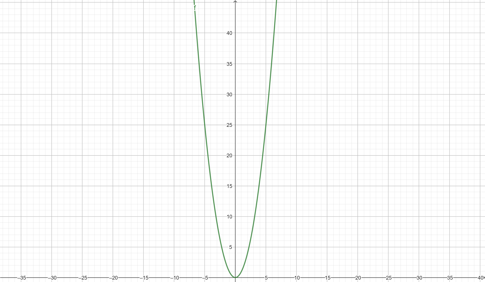
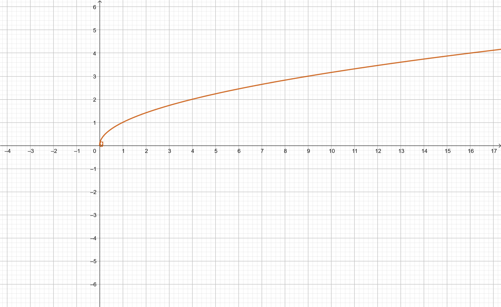
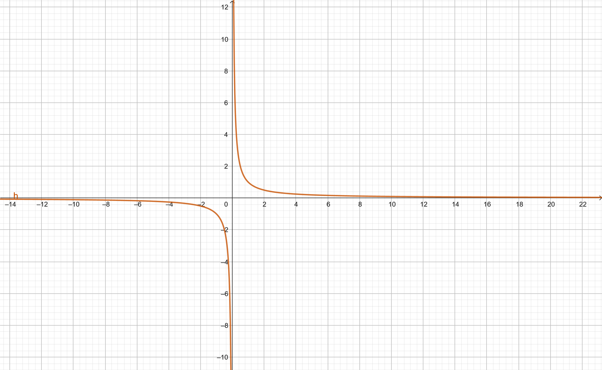
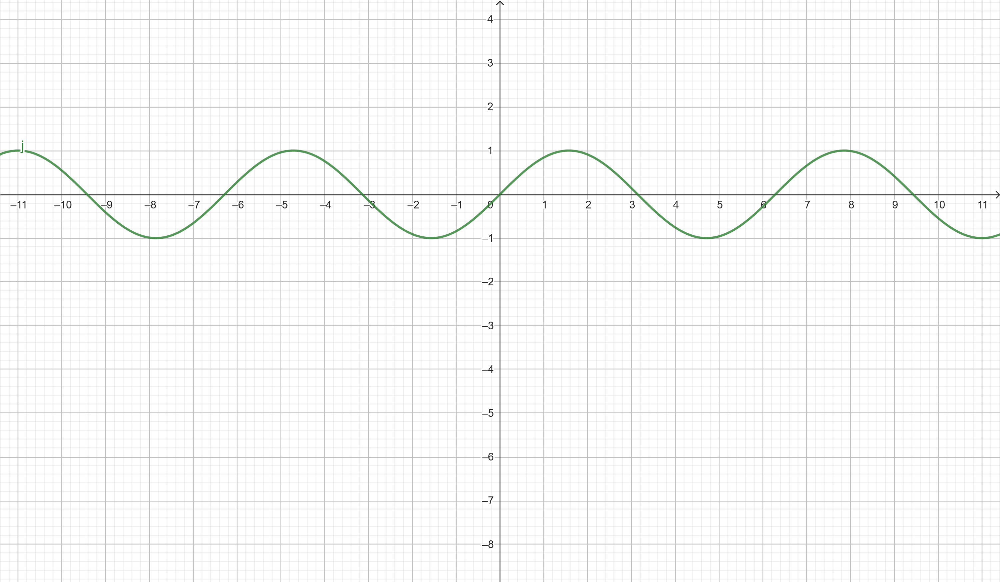

1. Draw in a single Geogebra notebook the following functions:

- $$f(x) = x^2$$
- $( f(x) = x^2 $), so $( f(2) = 2^2 = 4 $)

- $$g(x) = \sqrt{x}$$
$$ g(x) = \sqrt{x} $$
 
For \( x = 2 \):
 
$$ g(2) = \sqrt{2} \approx 1.414 $$

- $$h(x) = \frac{1}{x}$$

**- $$ h(x) = \frac{1}{x} $$ so $$ h(2) = \frac{1}{2} = 0.5 $$**

- $$j(x) = \sin(x)$$
**- $$ j(x) = \sin(x) $$, so $$ j(2) = \sin(2) \approx 0.909 $$**

